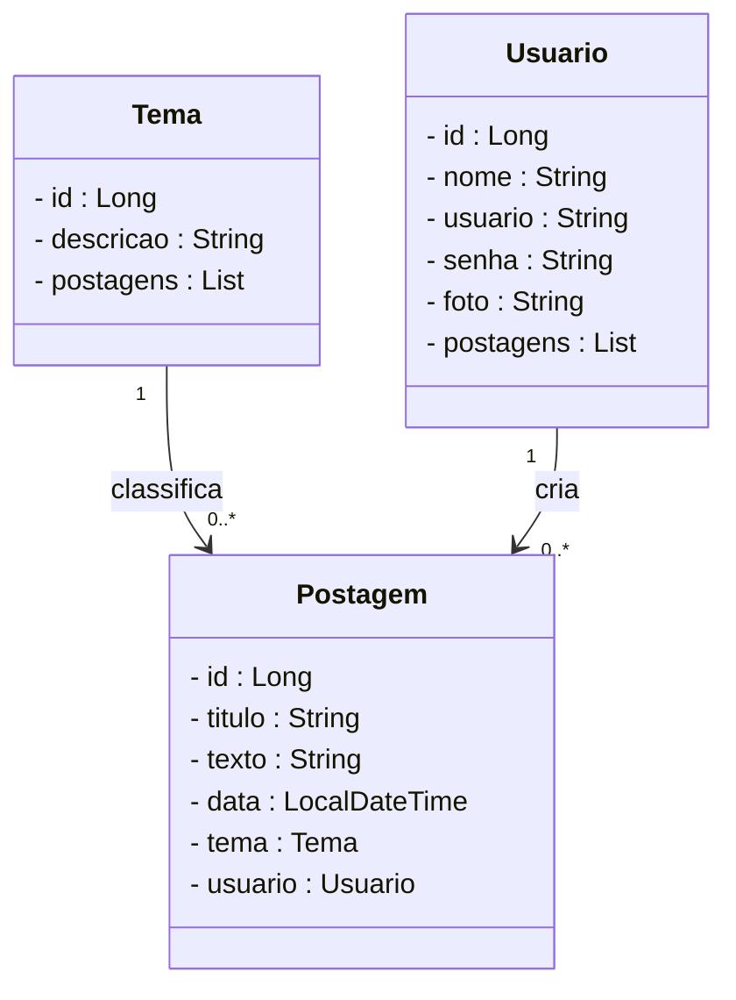
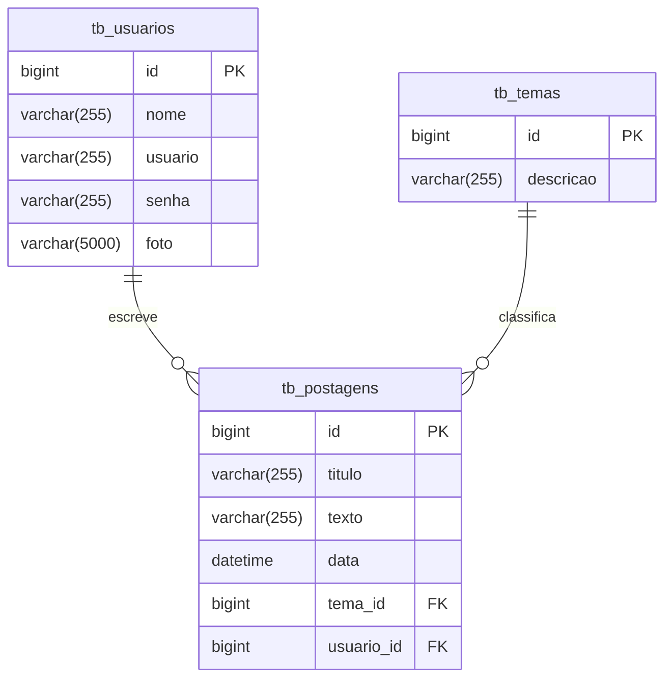

# 🚀 Projeto Blog Pessoal - Backend com Spring Boot

<div align="center">
  
</div>

<div align="center">
  
  
  
  
  
  
  
</div>

---

## 📌 Descrição

O **Blog Pessoal** é uma aplicação backend que permite aos usuários criar, editar e visualizar postagens sobre diversos temas. Desenvolvido com fins educacionais, o projeto simula um blog real para praticar conceitos de API REST com Java e Spring Boot.

### ✨ Funcionalidades principais:

- 📝 CRUD de postagens
- 🗂️ Associação de postagens a temas
- 👤 Cadastro e login de usuários
- 🔍 Filtro por tema ou autor
- 🔐 Controle de acesso com autenticação JWT

---

## ⚙️ Sobre a API

A API foi construída com **Java + Spring Boot**, seguindo os padrões **MVC** e **RESTful**. Os principais recursos são:

- 👥 Usuário
- 📝 Postagem
- 🗂️ Tema

### 🔧 Funcionalidades da API:

- Cadastro, login e atualização de usuários
- Gerenciamento de temas
- CRUD de postagens
- Associação de postagens a temas e autores
- Autenticação via JWT

---

## 📐 Diagrama de Classes



---

## 🗃️ Diagrama Entidade-Relacionamento (DER)



--- 

## 🛠️ Tecnologias Utilizadas

| 🔧 Tecnologia                 | 💡 Descrição             |
|-----------------------------|--------------------------|
| **Servidor**                | Tomcat                   |
| **Linguagem de Programação**| Java                     |
| **Framework**               | Spring Boot              |
| **ORM**                     | JPA + Hibernate          |
| **Banco de Dados**          | MySQL                    |
| **Segurança**               | Spring Security          |
| **Autenticação**            | JWT                      |
| **Testes Automatizados**    | JUnit                    |
| **Documentação da API**     | SpringDoc (Swagger UI)   |

---

## 📋 Requisitos

1. ☕ Java JDK 17+
2. 🛢️ MySQL
3. 🧰 Spring Tool Suite (STS)
4. 🔍 Insomnia ou Postman

---

## ▶️ Como Executar o Projeto

### 📥 Importando no STS

```text
  git clone https://github.com/rafaelq80/blogpessoal_spring_t82.git
```

### Abra o STS e selecione o Workspace

- Vá em File > Import...
- Escolha General > Existing Projects into Workspace
- Selecione a pasta clonada
- Finalize a importação

### 🚀 Executando

- Vá até a guia Boot Dashboard
- Selecione o projeto
- Clique em Start or Restart
- Verifique se o banco db_blogpessoal foi criado
- Teste os endpoints com Insomnia ou Postman
- 💡 Acesse http://localhost:8080 para visualizar a documentação Swagger da API.
  
---

## ✅ Executando os Testes

- 🔍 Localizando as classes
- Navegue até src/test/java
- Procure por classes com sufixo Test

### 🧪 Executando
- Clique com o botão direito na classe ou pasta
- Selecione Run As > JUnit Test

### 📊 Resultados
Verde = sucesso ✅
- Vermelho = falha ❌
- Veja os detalhes em Failure Trace

---

# 👩‍💻 Desenvolvido por

- Nicolly Jesus
- https://www.linkedin.com/in/nicolly-jesus/
- Data: 2025
